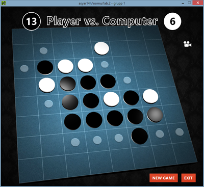

# Othello in Java

This was a school assignment in the object-oriented programming course. I decided to push the boundaries of the assignment a bit and implement a 3D game interface for the fun of it!

